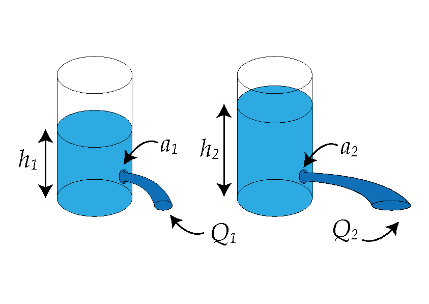
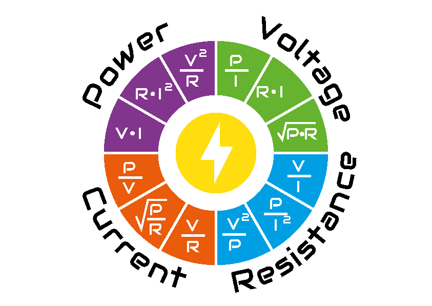
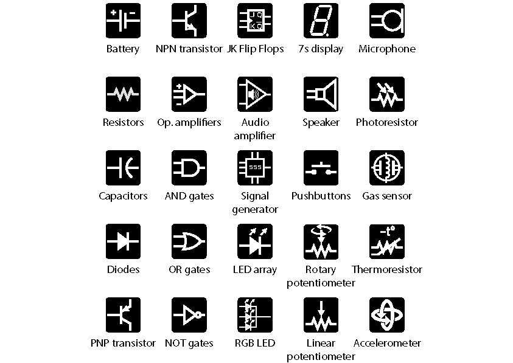
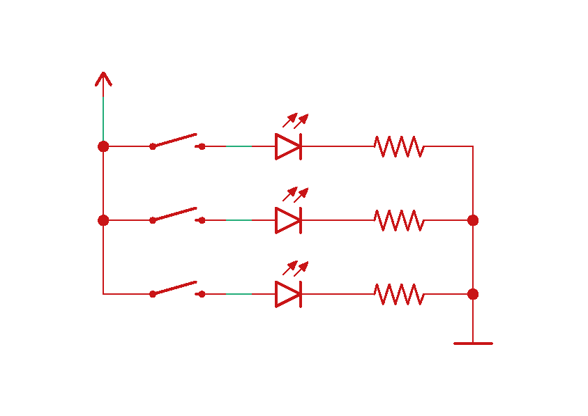

🚀 Learning electronics
========================
*Electronics* is the branch of science and technology that deals with the flow of electrons through conductors, semiconductors, and vacuum or gas-filled tubes. It plays a crucial role in modern society, powering everything from smartphones to spacecraft.

Definitions
^^^^^^^^^^^^^^^^^^^^^^^^^^^^
But let's start from the beggining, introducing some of the essential definitions, such as electric *voltage*, *current* and *resistance*

- Voltage (:math:`V`) is the electrical potential difference that drives the current. It is measured in volts [V].
- Electric current (:math:`I`) is the flow of electric charge, carried by electrons through a conductor. It is measured in amperes [A], often abbreviated as "amps."
- Resistance (:math:`R`) is the property of a material that opposes the flow of electric current. It is measured in ohms [:math:`\Omega`].

These definitions are interesting, but things get much more clear if we can make an analogy to something we may be more comfortable understanding: imagine you have two glasses filled with water, each with a hole at the bottom. The amount of water in each glass represents the electric charge, and the holes areas (:math:`a`) represent the electrical resistance. The height (:math:`h`) of the water on each glass (which can be understood as the pressure made by the column of water at the hole height) can be thought as the voltage, leaving the flow (:math:`Q`) as the electric current.

Additionally, we can define the concept of electric power (:math:`P`) as the rate at which electrical energy is converted into other forms of energy, such as light, heat, or motion, in an electrical circuit. In simpler terms, it's the amount of energy that electric devices use or produce per unit of time. It's like how fast a light bulb can turn electricity into light, or how quickly a motor can turn electricity into movement. It is measured in watts (W).

Relations
^^^^^^^^^^^^^^^^^^^^^^^^^^^^

    

Ohm's Law states that the current flowing through a conductor between two points is directly proportional to the voltage across the two points and inversely proportional to the resistance between them. Mathematically, Ohm's Law is expressed as :math:`V = I \cdot R`, but it can be rearranged as :math:`I = \frac{V}{R}` or :math:`R = \frac{V}{I}`

From the water analogy, we it's easily to mentally picture that if the hole has the size (:math:`a_1 = a_2`) but the colum of water in the second glass is higher than the first one (:math:`h_2 > h_1`), so it is the pressure at the hole point. Therefore the flow will be also higher on the second glass with respect to the first one (:math:`Q_2 > Q_1`).

On the other hand, the electric power can be calculated as :math:`P = V \cdot I`. However if we apply Ohm's law and replace some parameters, it can be expressed as :math:`P = R \cdot I^2` or :math:`P = \frac{V^2}{R}`

Circuit Symbols and Diagrams
^^^^^^^^^^^^^^^^^^^^^^^^^^^^

Circuit symbols are graphical representations of electronic components used in circuit diagrams. Understanding these symbols is essential for interpreting and designing electronic circuits. In the following examples, you will get more familiar with some of the following symbols and the components they represent.

Circuit diagrams depict the connections between components and their arrangement within a circuit. On this documentation we will be using two main colors: red, to represent the component (or system) already integrated on the ElectroLab, and green, to represent the wiring route.

How to work in the ElectroLab
^^^^^^^^^^^^^^^^^^^^^^^^^^^^^^

On the ElectroLab you can directly make all the connections between the different components, trying first to interpret the schematic, for later make the circuit on the board.

Through the upcomming docs, you will see interactive illustrations like this one, which represent the previous schematic:

.. raw:: html
        
    <iframe src="_static/Circuits/PB_LEDs/Circuit.html" style="width: 100%; height: 500px; border: none;"></iframe>

You can navigate through each step forward ➡️ and backward ⬅️, or enter directly the step you want.
You can also visualize all the steps at once by clicking on the 👁 (eye icon).

As you can identify, there are 4 wires, which represent the 4 green traces from the schematic, while the red components are the pushbuttons set and the LEDs system (internally connected to resistors).

Example circuits
^^^^^^^^^^^^^^^^

Through the following example circuits, you will learn different circuits that will probe to be not only  educational, but also useful for potential applications you might encounter!

.. toctree::
   :maxdepth: 2
   :numbered:

   examples/0_basics/main
   examples/1_analog/main
   examples/2_digital/main
   examples/3_oscillators/main
