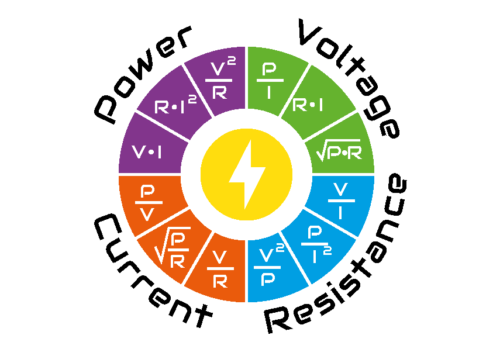

Basic circuits
==============

*Electronics* is the branch of science and technology that deals with the flow of electrons through conductors, semiconductors, and vacuum or gas-filled tubes. It plays a crucial role in modern society, powering everything from smartphones to spacecraft.

On the following examples, you will get introduced to the very basics of electronics, important concepts and to some of the most essential components:

.. toctree::
   :maxdepth: 2
   :glob:
   
   Resistors
   Capacitors
   Diodes
   Transistors

Definitions
-----------

But let's start from the beggining, introducing some of the essential definitions, such as electric *voltage*, *current* and *resistance*

- Voltage ($V$) is the electrical potential difference that drives the current. It is measured in volts [V].
- Electric current ($I$) is the flow of electric charge, carried by electrons through a conductor. It is measured in amperes [A], often abbreviated as "amps."
- Resistance ($R$) is the property of a material that opposes the flow of electric current. It is measured in ohms [$\Omega$].

.. figure:: ../../images/examples/Image1.png
    :align: right
    :figwidth: 300px

These definitions are interesting, but things get much more clear if we can make an analogy to something we may be more comfortable understanding: imagine you have two glasses filled with water, each with a hole at the bottom. The amount of water in each glass represents the electric charge, and the holes areas ($a$) represent the electrical resistance. The height ($h$) of the water on each glass (which can be understood as the pressure made by the column of water at the hole height) can be thought as the voltage, leaving the flow ($Q$) as the electric current.

Additionally, we can define the concept of electric power ($P$) as the rate at which electrical energy is converted into other forms of energy, such as light, heat, or motion, in an electrical circuit. In simpler terms, it's the amount of energy that electric devices use or produce per unit of time. It's like how fast a light bulb can turn electricity into light, or how quickly a motor can turn electricity into movement. It is measured in watts (W).

Relations
----------

    

Ohm's Law states that the current flowing through a conductor between two points is directly proportional to the voltage across the two points and inversely proportional to the resistance between them. Mathematically, Ohm's Law is expressed as $V = I \cdot R$ , but can be rearranged as $I = {V  \over R}$ or $R = {V \over I}$ :math:`R = \frac{V}{I}`

On the other hand, the electric power can be calculated as $P = V \cdot I$. However if we apply Ohm's law and replace some parameters, it can be expressed as $P = R \cdot I^2$ or $P = {V^2 \over R}$

Circuit Symbols and Diagrams
-----------------------------

Circuit symbols are graphical representations of electronic components used in circuit diagrams. Understanding these symbols is essential for interpreting and designing electronic circuits. Circuit diagrams depict the connections between components and their arrangement within a circuit.

In the following examples, you will get more familiar with some of the following symbols and the components they represent.

.. figure:: ../../images/examples/Image3.png
    :align: center
    :figwidth: 1000px